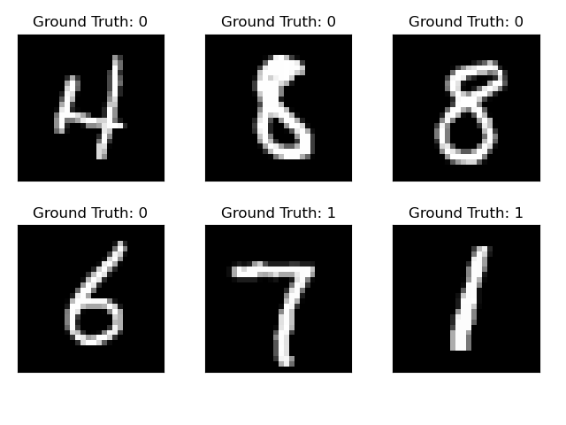

This is a template code on how to use Pytorch for deep learning. The classification task we considered is to identify odd/even in MNIST data.

## Requirement

We have used conda virtual environment to setup the following packages:

Python == 3.8

torch == 1.12.1

torchvision == 0.2.2

In order to directly setup the environment, use the following command:

```pip install -r requirements.txt```

## Training

Next step is to download and train the model with:

```python train.py```

The downloaded data will be stored in 'files/' and the trained model will be stored in 'results/'. Following figure shows that label of MNIST dataset are modified to suit our classification task



## Testing

In order to load the trained model and perform prediction, run the following code:

```python test.py```

#Summary
The model was trained with no gpu and over 3 epochs. The achieved accuracy over testset is 98%.
